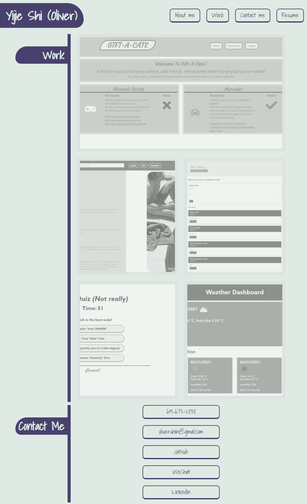

# REACT PORTFOLIO

## 

## Table of Contents

- [Description](#Description)
- [Contribution Guidelines](#Contribution-Guidelines)
- [Test Instructions](#Test-Instructions)
- [GitHub Page](#GitHub-Page)
- [Questions](#Questions)

## Description

This is my personal portfolio coded with React. At this site you will find a brief introduction of myself, links to some of my past works and their GitHub repositories, as well as my contact info along with a downloadable pdf of my resume.

This portfolio is deployed on GitHub Pages and is available at the following link:

https://runescape11111.github.io/portfolio-react/

## Sample Page

### Page with past projects



## Contribution Guidelines

```
N/A
```

## Test Instructions

```
N/A
```

## GitHub Page

https://github.com/runescape11111/portfolio-react

## Questions

GitHub profile: github.com/runescape11111/

Email: olivershih@gmail.com
